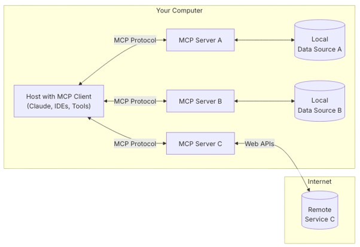

## 개요
최근 대규모 언어모델(LLM)을 활용한 AI 애플리케이션이 급증하면서 외부 시스템과의 연동 방식도 점점 복잡해지고 있다.  
각 시스템마다 커스텀으로 API나 커넥터를 개발하는 일은 시간이 많이 들고 비효율적이다.  
이런 문제를 해결하기 위해 Antropic에서 개발한 것이 **MCP(Model Context Protocol)**[^1]이다.

MCP는 AI 모델과 외부 데이터 및 도구를 연결해주는 표준 인터페이스라고 할 수 있다.  
Anthropic에서는 MCP는 AI 애플리케이션을 위한 USB-C 포트와 같다고 표현했다.  
USB-C가 다양한 주변기기에 디바이스를 연결하는 표준화된 방법을 제공하는 것처럼 MCP도 AI 모델을 다양한 데이터 소스 및 도구에 연결할 수 있는 표준화된 방법을 제공한다.

---

## 주요 특징과 구조

### 1. 표준화된 통합 방식
MCP의 핵심 목적은 서로 다른 시스템과 도구가 AI 모델과 쉽게 연결될 수 있도록 하는 것이다.   
별도의 맞춤형 통합 작업 없이 MCP 인터페이스를 구현하면 즉시 연결가능하다.

### 2. 클라이언트-서버 구조
MCP는 기본적으로 다음과 같은 구성 요소를 통해 클라이언트-서버 구조로 동작한다.

| 요소 | 설명                                                        |
|:---:|:----------------------------------------------------------|
| 호스트 | AI 모델을 활용해 데이터를 불러와 사용하는 애플리케이션 (e.g. Claude 데스크톱 앱, IDE) |
| 클라이언트 | 호스트가 요청하는 데이터를 가져오는 커넥터                                   |
| 서버 | MCP 프로토콜을 통해 데이터나 특정 기능을 제공하는 서비스|
| 데이터 소스 | 서버가 접근할 수 있는 파일, 데이터베이스 또는 원격 API 등 |

### 3. 모듈형 컴포넌트
MCP는 아래와 같은 모듈형 구성요소를 통해 AI 모델과 유연한 연동을 지원한다.

| 요소 | 설명                                |
|:---:|:----------------------------------|
|리소스| AI 모델이 접근할 수 이쓴ㄴ 콘텐츠 및 데이터        | 
| 프롬프트 | 반복적으로 사용할 수 있는 질문, 요청 양식          |
| 도구 | AI모델을 직접 호출하고 사용할 수 있는 기능, 명령어 모음 | 
| 샘플링| 서버에서 AI 모델에 출력을 요청하는 매커니즘 |

### 4. 유연한 통신 방식 지원
MCP는 표준 입출력 방식과 이벤트 스트리밍 방식을 지원하는 다양한 환경에 쉽게 적용할 수 있다.

---
## 활용

### 1. 기업 내부 시스템 연동
MCP를 활용하면 기업 내부에서 사용하는 다양한 시스템 및 서비스와 AI 모델을 손쉽게 연동할 수 있다.  
예를 들어, Slack과 MCP를 통해 업무 중 궁금한 사항을 챗봇에 문의하면 AI 모델이 관련 정보를 즉시 검색하여 Slack 채널에 전달하는 방식으로 업무 효율성을 높일 수 있다.

### 2. IDE 및 개발 도구 연동
IDE와 MCP를 연동하면 코드 작성, 자동 완성, 디버깅 등의 작업을 AI로 더욱 효율적으로 수행할 수 있다.  
예를 들어, 개발자가 코드를 작성할 때 AI가 MCP를 통해 기존 프로젝트의 코드베이스에서 유사한 코드를 찾아 자동으로 추천하거나 에러 발생 시 해결 방법을 실시간으로 제안할 수 있다.

### 3. 자동화된 워크플로우 구축
MCP를 사용하여 반복적이고 복잡한 작업을 자동화할 수 있다.  
예를 들어, 문서 자동화 업무에서 MCP를 통해 AI가 미리 정의된 프롬프트와 데이터를 사용해 보고서를 작성하거나 데이터베이스에서 최신 데이터를 자동으로 추출하여 정기 보고서를 생성하는 데 활용할 수 있다.

### 4. 데이터 분석 및 시각화
MCP를 활용하여 데이터 분석 및 시각화 작업을 자동화할 수 있다.  
예를 들어, 다양한 데이터 소스에서 정보를 수집하고 AI가 이를 분석하여 인사이트를 도출한 후 시각화 도구를 통해 결과를 표현하는 방식으로 데이터 기반 의사결정을 지원할 수 있다.

---
## Ref.
[^1]: [Anthropic MCP](https://modelcontextprotocol.io/introduction)
